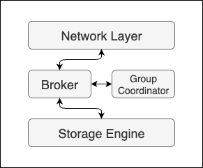

[简体中文](./README_zh-CN.md)

# Aeon - A Kafka-compatible message queue in Rust

Aeon is a high-performance, Kafka-protocol compatible message queue built from scratch in asynchronous Rust. It aims to explore the core principles of modern distributed messaging systems, drawing inspiration from platforms like Apache Kafka and Redpanda.

**This project is currently at `v0.1.0`, focusing on a complete, single-node core engine.**

## 🌟 v0.1.0 Highlights & Features

The `v0.1.0` release delivers a robust, single-node message broker with a focus on protocol correctness, storage efficiency, and a complete consumer group implementation.

*   **🚀 Kafka Protocol Compatibility**: Fully compatible with the Kafka protocol, allowing the use of standard Kafka clients (`rdkafka`, Java clients, etc.) for producing and consuming messages.
    *   Implemented via a `build.rs` script that parses Kafka's official JSON protocol specifications to automatically generate Rust structs and serialization/deserialization logic. This ensures correctness and easy upgrades.

*   **💾 High-Performance Log Storage Engine**:
    *   Built with memory-mapped files (`mmap`) for zero-copy reads and high-throughput writes.
    *   Features a segmented log design, where each partition is composed of multiple segment files.
    *   Implements a sparse in-memory index for each segment, allowing for fast offset lookups without loading the entire index into memory.

*   **🔄 Complete Consumer Group Implementation**:
    *   Features a fully functional Group Coordinator on the broker side to manage consumer groups.
    *   Supports dynamic partition rebalancing as consumers join or leave the group.
    *   Handles the complete Kafka consumer group protocol suite (`FindCoordinator`, `JoinGroup`, `SyncGroup`, `Heartbeat`, `OffsetCommit/Fetch`).

*   **⚙️ Asynchronous Architecture**:
    *   Built entirely on `tokio`, leveraging Rust's async/await for high concurrency and efficient I/O handling.
    *   Each consumer group is managed by a dedicated asynchronous task (Actor model), ensuring isolation and scalability.

## 🏛️ Architecture (v0.1.0)



The single-node architecture of Aeon `v0.1.0` is composed of several key components:

1.  **TCP Server (`server`)**: The front door of the broker. It listens for incoming Kafka client connections, decodes raw byte streams into Kafka `Request` frames, and passes them to the handler.
2.  **Request Handler (`handler`)**: Decodes the request type and dispatches it to the appropriate logic within the `Broker`. It then encodes the `Response` and sends it back to the client.
3.  **Broker (`broker`)**: The central component that orchestrates all broker activities. It holds the metadata for topics, partitions, and consumer groups.
4.  **Group Coordinator (`coordinator`)**: Manages the lifecycle of consumer groups. Each group is handled by its own async task, processing events like joining members, heartbeats, and triggering rebalances.
5.  **Storage Engine (`storage`)**: The persistence layer. It manages the physical log segments on disk for each topic-partition.
    *   **Log (`log`)**: A logical representation of a topic-partition's ordered message sequence.
    *   **Segment (`segment`)**: A single log file on disk, backed by `mmap`. Contains the actual `RecordBatch` data.
    *   **Index**: A sparse index file for each segment, mapping message offsets to physical byte positions in the segment file.

## 🚀 Getting Started

Currently, the primary way to run and interact with Aeon is through the integration tests.

1.  **Clone the repository**:
    ```bash
    git clone https://github.com/your-username/aeon.git
    cd aeon
    ```

2.  **Run the integration test**:
    This test will start a broker, create a topic, produce 10 messages, and consume them using a consumer group.
    ```bash
    cargo test --test consumer_group_test
    ```

## 🗺️ Roadmap

*   **v0.1.0**: Single-Node Core (✅)
*   **v0.2.0**: Persistence & Recovery (WIP)
    *   Snapshotting coordinator state.
    *   Robust crash recovery for the storage engine.
*   **v0.3.0**: Distributed Capabilities
    *   Implementation of a Raft consensus algorithm for metadata management.
    *   Multi-broker cluster support.
